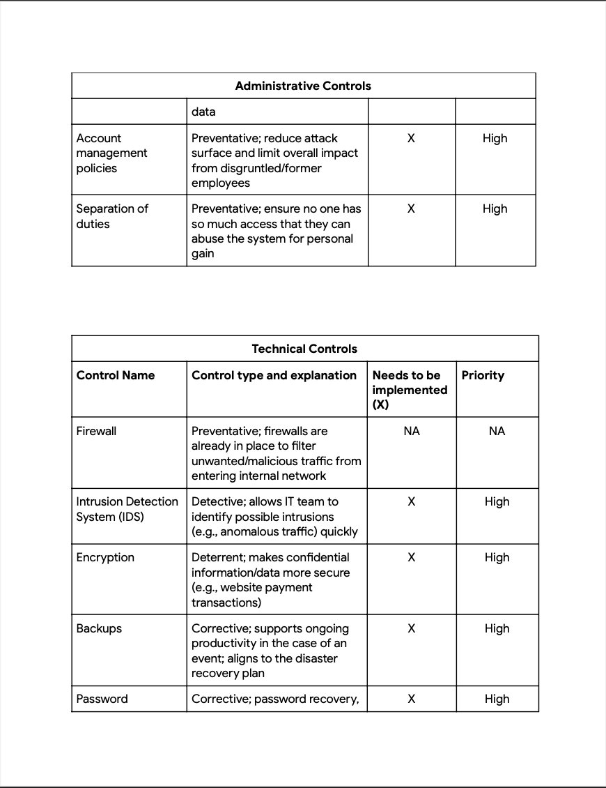

# **Scenario**

Botium Toys is a small U.S. business that develops and sells toys. The business has a single physical location. However, its online presence has grown, attracting customers in the U.S. and abroad. Their information technology (IT) department is under increasing pressure to support their online market worldwide.

The manager of the IT department has decided that an internal IT audit needs to be conducted. She expresses concerns about not having a solidified plan of action to ensure business continuity and compliance, as the business grows. She believes an internal audit can help better secure the company’s infrastructure and help them identify and mitigate potential risks, threats, or vulnerabilities to critical assets. The manager is also interested in ensuring that they comply with regulations related to accepting online payments and conducting business in the European Union (E.U.).

The IT manager starts by implementing the National Institute of Standards and Technology Cybersecurity Framework (NIST CSF), establishing an audit scope and goals, and completing a risk assessment. The goal of the audit is to provide an overview of the risks the company might experience due to the current state of their security posture. The IT manager wants to use the audit findings as evidence to obtain approval to expand his department.

Your task is to review the IT manager’s scope, goals, and risk assessment. Then, perform an internal audit to complete a controls assessment and compliance checklist.

## **Solution**  
---
**Step 1 (Listing the audit goals, scope, and risk assessment):**
### Scope: 
Botium Toys internal IT audit will assess the following:
- Current user permissions set in the following systems: accounting, end point detection, firewalls, intrusion detection system, security information and event management (SIEM) tool. 
- Current implemented controls in the following systems: accounting, end point detection, firewalls, intrusion detection system, Security Information and Event Management (SIEM) tool. 
- Current procedures and protocols set for the following systems: accounting, end point detection, firewall, intrusion detection system, Security Information and Event Management (SIEM) tool. 
- Ensure current user permissions, controls, procedures, and protocols in place align with necessary compliance requirements. 
- Ensure current technology is accounted for. Both hardware and system access.

### Goals:
The goals for Botium Toys’ internal IT audit are to:
- Adhere to the National Institute of Standards and Technology Cybersecurity Framework (NIST CSF) 
- Establish a better process for their systems to ensure they are compliant - Fortify system controls 
- Implement the concept of least permissions when it comes to user credential management 
- Establish their policies and procedures, which includes their playbooks 
- Ensure they are meeting compliance requirements

**Risk assessment**

Current assets; assets managed by the IT Department include:
- On-premises equipment for in-office business needs 
- Employee equipment: end-user devices (desktops/laptops, smartphones), remote workstations, headsets, cables, keyboards, mice, docking stations, surveillance cameras, etc. 
- Management of systems, software, and services: accounting, telecommunication, database, security, ecommerce, and inventory management 
- Internet access 
- Internal network 
- Vendor access management 
- Data center hosting services 
- Data retention and storage 
- Badge readers 
- Legacy system maintenance: end-of-life systems that require human monitoring

**Risk description**

Currently, there is inadequate management of assets. Additionally, Botium Toys does not have the proper controls in place and may not be compliant with U.S. and international regulations and standards.

**Control best practices**

The first of the five functions of the NIST CSF is Identify. Botium Toys will need to dedicate resources to managing assets. Additionally, they will need to determine the impact of the loss of existing assets, including systems, on business continuity.

**Risk score**

On a scale of 1 to 10, the risk score is 8, which is fairly high. This is due to a lack of controls and adherence to necessary compliance regulations and standards.

**Additional comments**

The likelihood of a lost asset or fines from governing bodies is high because Botium Toys does not have all of the necessary controls in place and is not adhering to required regulations and standards related to keeping customer data private.

---
**Step 2 (Analyzing the audit goals, scope, and risk assessment)**

-What are the biggest risks to the organization?  
Data breach  
Data/Identity theft

-Which controls are most essential to implement immediately versus in the future?  
Please refer to the controls assessment list in step 3.

-Which compliance regulations does Botium Toys need to adhere to, to ensure the company keeps customer and vendor data safe, avoids fines, etc.?  
Payment Card Industry Data Security Standards (PCI DSS)  
General Data Protection Regulation (GDPR)  
System and Organizations Controls (SOC type 1, SOC type 2)  

**Step 3 (Conducting the audit: Controls assessment)**

-All listed assets are accounted for in the controls selected.

-Appropriate administrative, technical, and physical controls are selected (marked with an X)

The priority level for each control selected is noted, based on the need for immediate or future implementation.  

---

**Step 4 (Conducting the audit: Compliance checklist)**

-The compliance regulations and standards that Botium Toys needs to adhere to are selected (i.e., related to conducting business in the E.U., accepting online payments, user permission policies)

The need for each regulation and standard selected is explained.

**Step 5 (Communicating the results)**  
Below is a summary of the security audit conducted for Botium Toys to be communicated to stakeholders:  

This assessment emphasizes the need to urgently implement certain measures to protect data and ensure compliance with regulations. We must put in place administrative and technical controls to safeguard information and maintain business operations. These controls manage who can access data, how they access it, and when it's accessible. Following these rules is crucial for adhering to regulatory standards like SOC type 1, SOC type 2, PCI DSS, and GDPR, which govern data access and security. As Botium Toys conducts online business worldwide, failing to meet these regulations could lead to fines and data breaches. Some physical security measures can be addressed later, but we need to prioritize these critical controls first, so as to ensure the confidentiality, integrity and availability of data.