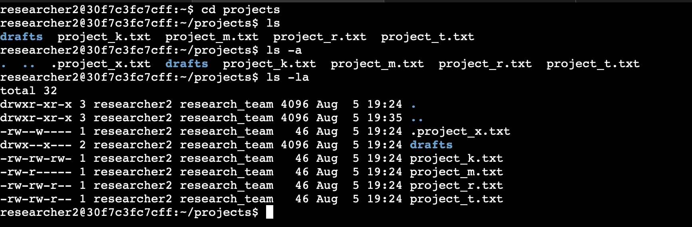
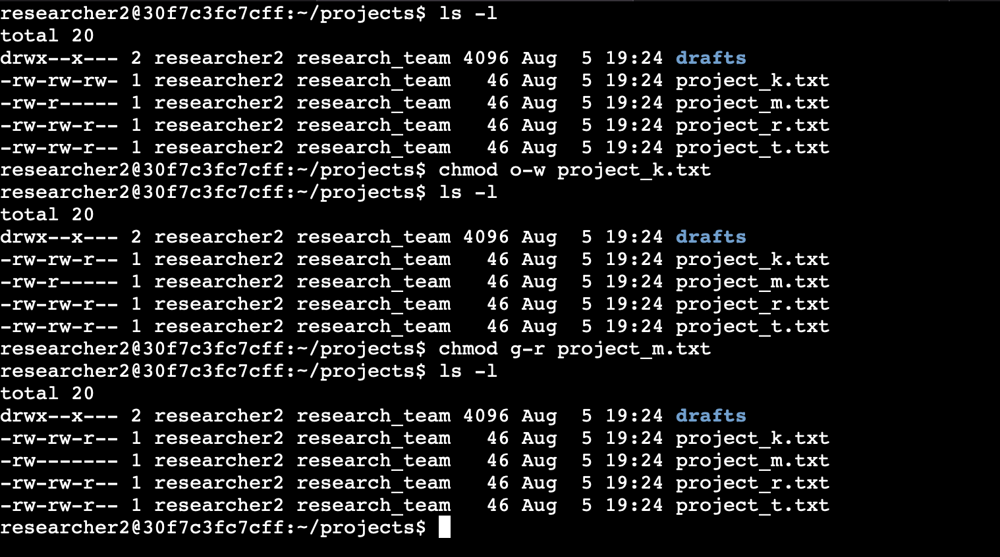
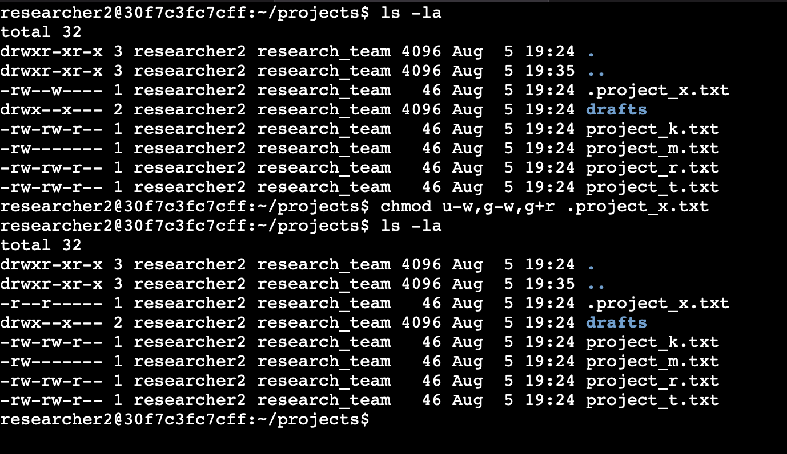
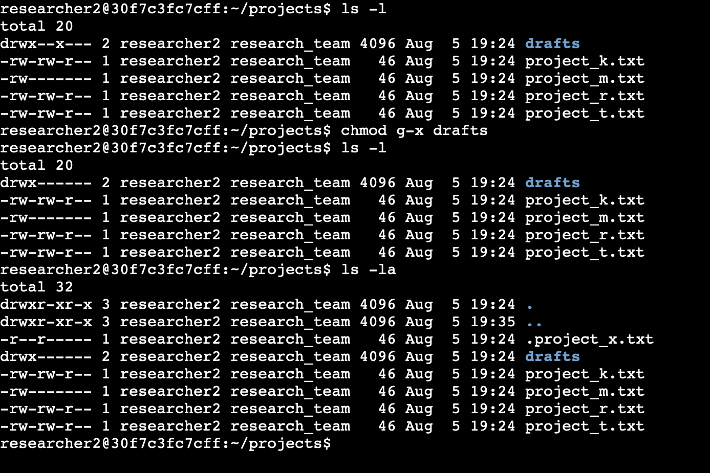

# **Scenario**
You are a security professional at a large organization. You mainly work with their research team. Part of your job is to ensure users on this team are authorized with the appropriate permissions. This helps keep the system secure. 

Your task is to examine existing permissions on the file system. You’ll need to determine if the permissions match the authorization that should be given. If they do not match, you’ll need to modify the permissions to authorize the appropriate users and remove any unauthorized access.  

## **Solution**  
### Project description:
The research team at my organization needs to update the file permissions for certain files and directories within the projects directory. The permissions do not currently reflect the level of authorization that should be given. Checking and updating these permissions will help keep their system secure and compliant. To complete this task, I performed the following tasks: 

**Step 1 (Checking file and directory details):**  
The commands used to check files and directories' details are:
>**ls** - displays the names of files and directories in the current working directory.    

>**ls -l** - displays permissions to files and directories.  

>**ls -a** - displays hidden files (hidden files start with a period (.) at the beginning).  

>**ls -la** - displays permissions to files and directories, including hidden files.  

Commands 1, 3, and 4 are used here respectively to explore the permissions of the projects directory and the files it contains.

**Step 2 (Description of the permissions string above):**

A 10-character string begins each entry and indicates how the permissions on the file are set.
* The 1st character indicates the file type. The d indicates it’s a directory. When this character is a hyphen (`-`), it's a regular file.
* The 2nd-4th characters indicate the read (`r`), write (`w`), and execute (`x`) permissions for the user. When one of these characters is a hyphen (`-`) instead, it indicates that this permission is not granted to the user.
* The 5th-7th characters indicate the read (`r`), write (`w`), and execute (`x`) permissions for the group. When one of these characters is a hyphen (`-`) instead, it indicates that this permission is not granted for the group.
* The 8th-10th characters indicate the read (`r`), write (`w`), and execute (`x`) permissions for the owner type of other. This owner type consists of all other users on the system apart from the user and the group. When one of these characters is a hyphen (`-`) instead, that indicates that this permission is not granted for other.  

For example, the file permissions for `project_r.txt` are `-rw-rw-r--`. The first chracacter is a hyphen (`-`). This indicates that `project_r.txt` is a file, not a directory. The second, fifth, and eigth characters are all `r`, which indicates that user, group, and other all have read permissions. The third and sixth characters are `w`, which indicates that only the user and group have write permissions. No one has execute permissions for `project_r.txt`.

**Step 3 (Changing file permissions):**  

The organization determined that other shouldn't have write access to any of their files. To
comply with this, I referred to the file permissions that I previously returned. I determined `project_k.txt` must have the write access removed for other and `project_m.txt` must have read access removed for group.  

  

The `chmod` command changes the permissions on
files and directories. The first argument indicates what permissions should be changed, and
the second argument specifies the file or directory. In this example, I removed write permissions from other for the `project_k.txt` file, and removed read permissions from group for the `project_m.txt`. After this, I used `ls -l` to review the updates I made after each change.

**Step 4 (Changing file permissions on a hidden file):**  

The file `.project_x.txt` is a hidden file that has been archived by the research team and should not be written to by anyone. Therefore, I set the permissions of the file `.project_x.txt` so that both the user and the group can read, but not write to the file.  
NB:A hidden file starts with a period (`.`).

Working on the `.project_x.txt` file permissions; I removed write permissions from the user with `u-w`, write permissions from the group with `g-w`, and added read permissions to the group with `g+r`.  

**Step 5 (Changing directory permissions):**

My organization wants only the `researcher2` user to have access to the drafts directory and its contents. (This means that only `researcher2` should have execute privileges).
  

I listed the files in the directories and used the `chmod` command to remove execute permissions from group. The `researcher2` user already had execute permissions, so they did not need to be added. I then listed all files and permissions in the projects directory, including hidden files, with the `ls -la` command.

### **Summary**  
I changed multiple permissions to match the level of authorization my organization wanted for
files and directories in the projects directory. I then used the chmod command multiple times to change the permissions on files and directories. This follows the principle of least privilege which further stregthens my organisation's security posture.