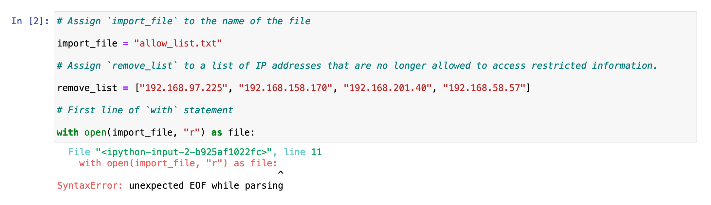
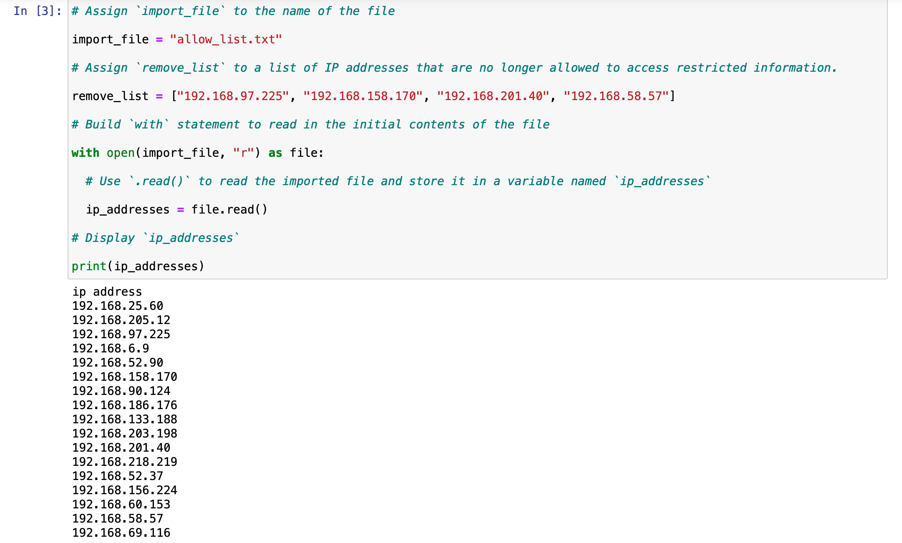
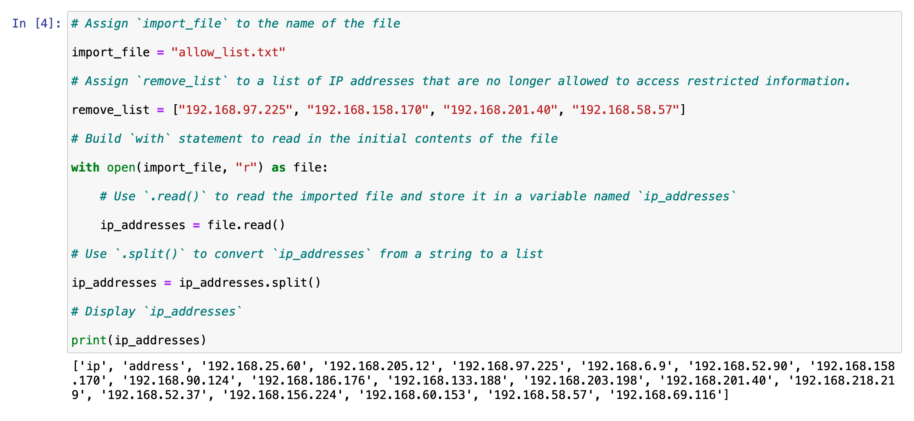
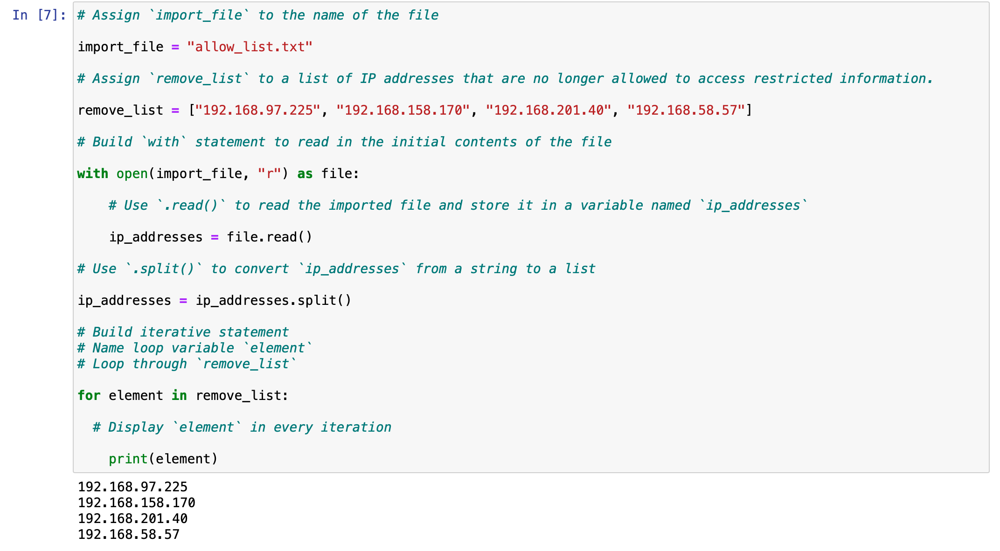
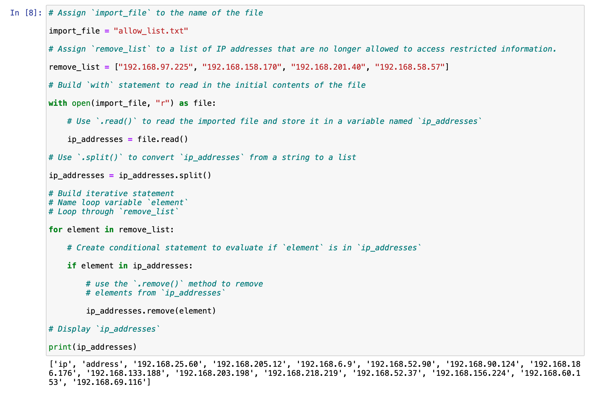
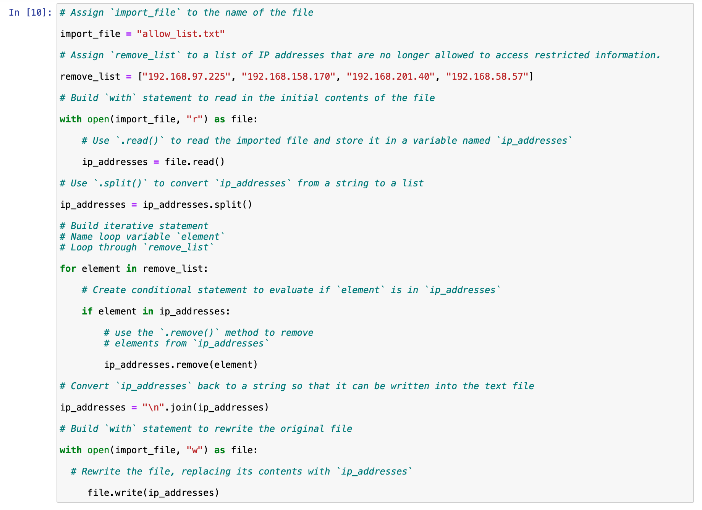

# **Scenario**
You are a security professional working at a health care company. As part of your job, you're required to regularly update a file that identifies the employees who can access restricted content. The contents of the file are based on who is working with personal patient records. Employees are restricted access based on their IP address. There is an allow list for IP addresses permitted to sign into the restricted subnetwork. There's also a remove list that identifies which employees you must remove from this allow list.

Your task is to create an algorithm that uses Python code to check whether the allow list contains any IP addresses identified on the remove list. If so, you should remove those IP addresses from the file containing the allow list.  
## **Solution**
**Project Description:**  
The health care company has a restricted file that needs its IP address’ allow list to be regularly updated. The `allow_list.txt` file holds these IP addresses, and the IP addresses that no longer have access to the file are identified by a remove list. I developed a Python algorithm that parses the `allow_list.txt` file and removes IP addresses that no longer have access.

**Step 1 (Opening the file that contains the allow list):**  

* I assigned the variable `import_file` to the `allow_list.txt` file for easy reference to the file.  
* I also assigned a variable `remove_list` to the list of IP addresses that are no longer allowed to access restricted information.  
* I used a `with` statement to open the file, and temporarily stored the file in the `file` variable while it was being accessed (`r`). This is necessary while working with the `with` statement.  
* The code produced an error because the code only contains the first line of the `with` statement, i.e. opening the file.

**Step 2 (Reading the file contents):** 

* I used the `.read()` method to read the imported file as a string and stored it in the variable named `ip_addresses` 
* I subsequently used the `print()` function to view the contents of the allow list (`ip_addresses`). 

**Step 3 (Converting the string into a list):**

To remove individual IP addresses from the allow list, the IP addresses needed to be in a list format. 
* I used the `.split()` method to convert the `ip_addresses` string into a list. 
* I then displayed the contents of the `ip_addresses` file using the `print()` function 

**Step 4 (Iterating through the remove list):**

I needed to write code to remove the elements of `remove_list` from the `ip_addresses` list. 
* I built an iterative statement; `for`, named the loop variable `element`, and looped through `remove_list`.
* I displayed the content of the variable (`element`).

**Step 5 (Removing IP addresses that are on the remove list):**

Here, I updated the body of the loop with code that will remove IP addresses from the allow list.
* Using the conditional statement `if`, I evaluated if the loop variable `element` is part of the `ip_addresses` list. This is important to avoid the errors that would occur when using the `.remove()` method if an element was not part of the `ip_addresses` list.
* Within the conditional statement (`if`), I applied the `.remove()` method to the `ip_addresses` list which removed the IP addresses identified in the loop variable `element`.
* After the iterative statement removed the elements, I displayed the updated `ip_addresses` list to verify that the elements of `remove_list` were no longer in the `ip_addresses` list.

**Step 6 (Updating the file with the revised list of IP addresses):**

I completed the algorithm by updating the `import_file` with the revised list (`ip_addresses`).
* A line of code containing the `.join()` method was added to the code so that the file could be updated. This was necessary because `ip_addresses` must be in string format when used inside the `with` statement to rewrite the file.  
* The `.join()` method takes in an iterable (such as a list) and concatenates every element of it into a string. The `.join()` method is applied to a string consisting of the character that will be used to separate every element in the iterable once it’s converted into a string. 
* I applied the `.join()` method to the string `\n`. The `\n` character indicates to separate each element by placing it on a new line, i.e., each element of `ip_addresses` would be returned on a new line.
* Finally, I built a `with` statement that rewrites the original file using the `w` parameter when calling the `open()` function. This deleted the contents in the original file (`import_file`) and replaced it with the revised list of IP addresses.

### **Summary**
I created a Python algorithm that removed IP addresses identified in a `remove_list` variable from the `allow_list.txt` file of approved IP addresses. It involved opening the file to be read as a string, and stored in a variable `ip_addresses`. This variable was converted into a list using the `.split()` method. I iterated through the `remove_list` and evaluated whether its elements were part of the `ip_addresses` list. I then used the `.remove()` method to remove the element if found in `ip_addresses`. Finally, the `.join()` method and `\n` was used to convert `ip_addressess` into a string so an overwrite with the revised list of IP addresses could be possible.
