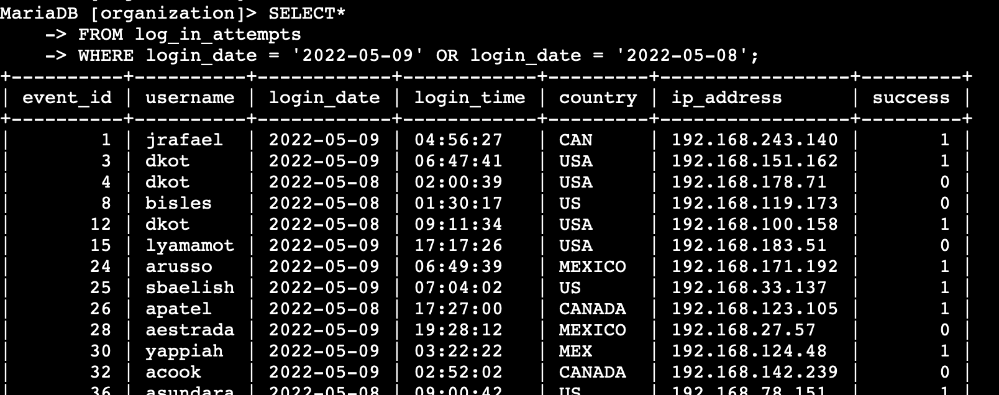

# **Scenario**
You are a security professional at a large organization. Part of your job is to investigate security issues to help keep the system secure. You recently discovered some potential security issues that involve login attempts and employee machines.

Your task is to examine the organization’s data in their `employees` and `log_in_attempts` tables. You’ll need to use SQL filters to retrieve records from different datasets and investigate the potential security issues.

## **Solution**
**Step 1 (Retrieving after-hours failed login attempts):**  

There was a potential security incident that occurred after business hours (after 18:00). All after-hours login attempts that failed need to be investigated. 

The `success` column in the `log_in_attempts` table contains values of `TRUE` or `FALSE` to indicate whether the login was successful. MySQL stores Boolean values as `1` for `TRUE`, and `0` for `FALSE`. This means that `TRUE` is represented as `1`, and `FALSE` is represented as `0` in the success column.

Therefore, I created a SQL query using a `WHERE` clause with an `AND` operator to filter my results to output only login attempts that occurred after 18:00 and were unsuccessful:  

**Step 2 (Retrieving login attempts on specific dates):**  

A suspicious event occurred on 2022-05-09. Any login activity that happened on 2022-05-09 or on the day before needs to be investigated.

I created a SQL query using a `WHERE` clause with an `OR` operator to filter my results to output only login attempts that occurred on either 2022-05-09 or 2022-05-08:  

**Step 3 (Retrieving login attempts outside of Mexico):**  
After investigating the organization’s data on login attempts, I believe there is an issue with the login attempts that occurred outside of Mexico and should be investigated.

I created a SQL query using a `WHERE` clause with `NOT` to filter my results for countries other than Mexico. I used `LIKE` with `MEX%` as the pattern to match because the `country` column represents Mexico as MEX and MEXICO. The percentage sign (`%`) represents any number of unspecified characters when used with `LIKE`:   

**Step 4 (Retrieving employees in marketing):**  
My team wants to update the computers for certain employees in the Marketing department. To do this, I have to get information on which employee machines to update.

I created a SQL query using a `WHERE` clause with `AND` to filter my results for employees who work in the Marketing department and in the East building. I used `LIKE` with `East%` as the pattern to match because the data in the office column represents the East building with the specific office number:

**Step 5 (Retrieving employees in finance or sales):**  

The computers for employees in the Finance and Sales departments also need to be updated. I have to get information on employees only from these two departments.

I created a SQL query using a `WHERE` clause with `OR` to filter my results for employees who are in the Finance and Sales departments. I used the `OR` operator instead of the `AND`operator because I want all employees who are in either department. 

**Step 6 (Retrieving all employees not in IT):**  

My team needs to make one more update. This update was already made to employee computers in the Information Technology department. The team needs information about employees who are not in that department. 

To do this, I created a SQL query using a `WHERE` clause with `NOT` to filter my results for employees not in this department:

  

### **Summary**  
I applied filters to SQL queries to get specific information on login attempts and employee machines. I used the two tables in the database; `log_in_attempts` and `employees`. I used the `AND`, `OR`, and `NOT` operators to filter for the specific information needed for each task. I also used `LIKE` and the percentage sign (`%`) wildcard to filter for patterns.